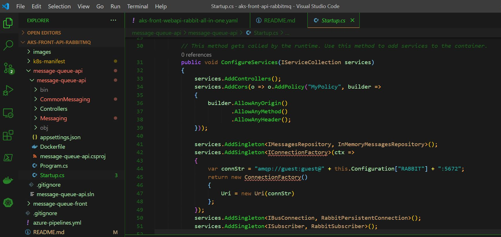
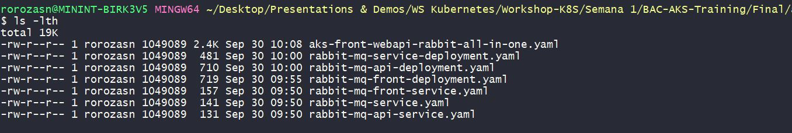
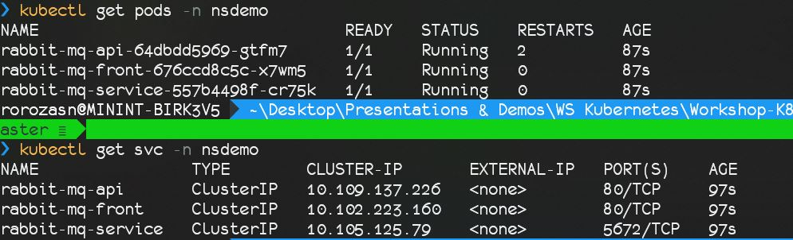
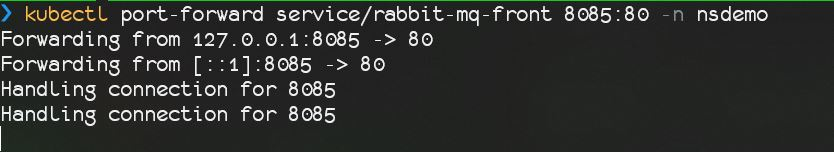
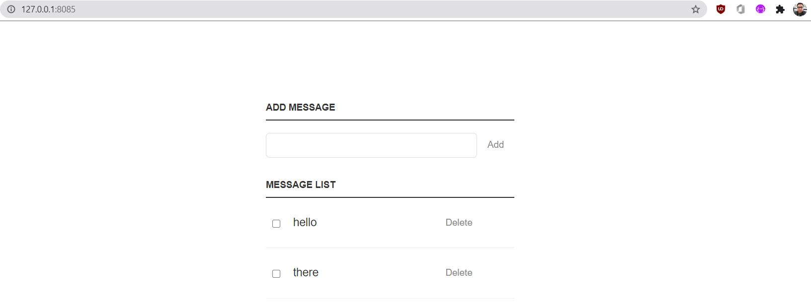
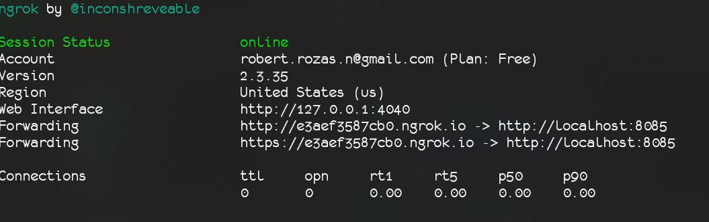
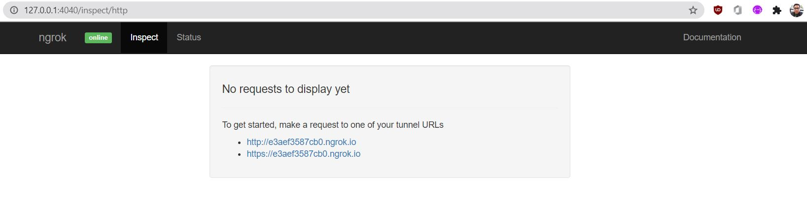

# aks-front-api-rabbitmq
3 microservices, one razor pages front end, one web api, and one rabbit-mq. :net Core 3.1


## Getting started

These examples were created and tested on Kubernetes from Docker Desktop and AKS.
You can check the application code from both, the front and and the api, at:

```
cd Final\aks-front-api-rabbitmq\message-queue-api
```
Or

```
cd Final\aks-front-api-rabbitmq\message-queue-front
```

Then you can open them, using Visual Studio Code, like:
```
code .
```

If we check the code from our `api` project, we can check how are we pointing our application, to consume our `rabbitmq` service



Here we can check how we use the endpoint, and how we are referencing and `environment` variable, called `RABBIT`on line 44. We are going to get more on that, later 🤓

## Deploying the application into our Kubernetes Instance (local or cloud)

First we are going to check the directory with the manifest files from all of our services

```
cd Final\k8s-manifest\
code .
```
Here we are going to see 7 files, 3 for each deployment and 3 for each of the services:

* RabbitMQ
* .Net Core API
* .Net Core Front End

The communication pattern looks something like this:

`RabbitMQ <-----> .Net Core API <-----> .Net Core Front End`

Wher the `rabbitmq` instance is `talking` with the `api`, and the `front` needs to consume the `api`

Now, we are going to check our `yaml` manifest:

```
ls -lth
```



Now we need to take a look at our files, for example, all the `*-deployment.yaml` files and check the `ENV` variables. Those are going to serve as glue, between our application to `talk`with each other and share information.


## Deploying the application into our Kubernetes Instance (local or cloud)

To deploy the application we need to be in our manifest directory
```
cd Final\k8s-manifest\
```
In order to do this, following the best practices, we are going to create a namespace `nsdemo`
<details>
  <summary>If you forget about, how to do it, you can check the solution!</summary>
  
  ```
kubectl create ns nsdemo
```
</details>

Then we need to deploy each of our files into the newly created namespace `nsdemo`, in the following order:
1. rabbit-mq-service-deployment.yaml
2. rabbit-mq-service.yaml
3. rabbit-mq-api-deployment.yaml
4. rabbit-mq-api-service.yaml
5. rabbit-mq-front-deployment.yaml
6. rabbit-mq-front-service.yaml

<details>
  <summary>If you forget about, how to do it, you can check this TIP!</summary>
  
```
kubectl apply -f aks-front-webapi-rabbit-all-in-one.yaml -n nsdemo
```
</details>

Then we are going to check our pods and services

<details>
  <summary>If you forget about, how to do it, you can check this TIP!</summary>
  
  ```
kubectl get pods -n nsdemo
kubectl get svc -n nsdemo
```
</details>

We should see something like this:


## Using NGROK, to expose our front-end service

First, we need to port-forward our service
```
kubectl port-forward service/rabbit-mq-front 8085:80 -n nsdemo
```


Once this is done, we can check our application running on `127.0.0.1:8085` or `localhost:8085`


Now we need to run from another terminal, the following command:
```
ngrok http 8085
```
This is going to create a tunnel and an `ngrok` url that it's going to expose our local application, to the internet.
Then you should see something very similar to this screen


Now we can open a new `browser` and check the `ngrok dashboard` at `http://127.0.0.1:4040`


Now, you can check any of those 2 url and you are going to see your application from anywhere on the internet 😎✔

Now you can share the first url with the trainer 🤖

HAPPY CODING!! 👾 


## License

(The MIT License)

Permission is hereby granted, free of charge, to any person obtaining a copy of this software and associated documentation files (the 'Software'), to deal in the Software without restriction, including without limitation the rights to use, copy, modify, merge, publish, distribute, sublicense, and/or sell copies of the Software, and to permit persons to whom the Software is furnished to do so, subject to the following conditions:

The above copyright notice and this permission notice shall be included in all copies or substantial portions of the Software.

THE SOFTWARE IS PROVIDED 'AS IS', WITHOUT WARRANTY OF ANY KIND, EXPRESS OR IMPLIED, INCLUDING BUT NOT LIMITED TO THE WARRANTIES OF MERCHANTABILITY, FITNESS FOR A PARTICULAR PURPOSE AND NONINFRINGEMENT. IN NO EVENT SHALL THE AUTHORS OR COPYRIGHT HOLDERS BE LIABLE FOR ANY CLAIM, DAMAGES OR OTHER LIABILITY, WHETHER IN AN ACTION OF CONTRACT, TORT OR OTHERWISE, ARISING FROM, OUT OF OR IN CONNECTION WITH THE SOFTWARE OR THE USE OR OTHER DEALINGS IN THE SOFTWARE.

SEUS, identity provider, Java...fallas más que nada a nivel de contingencias de azure...no se ha encontrado la causa raíz de las intermitencias...16 de agosto, IaC Terraform, AKS, express route 20 megas...se aplicaron beunas prácticas a nivel de sync con otras regiones en la bd postgresql...eastus fallas, septiembre comenzó..dynatrace & splunk...assesment a nivel de aks, recomendaciones